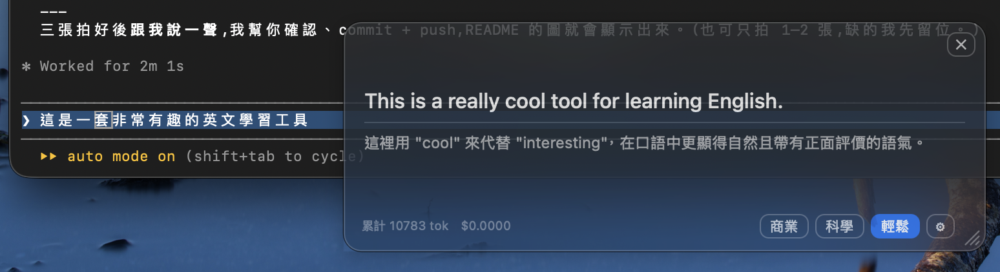
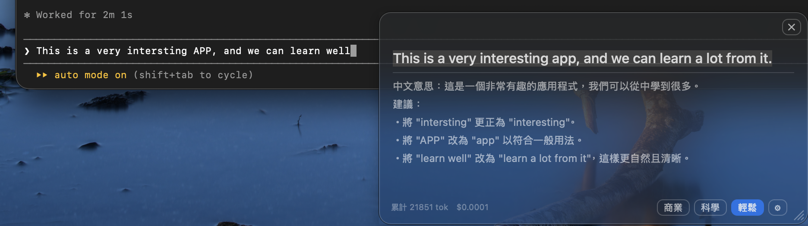
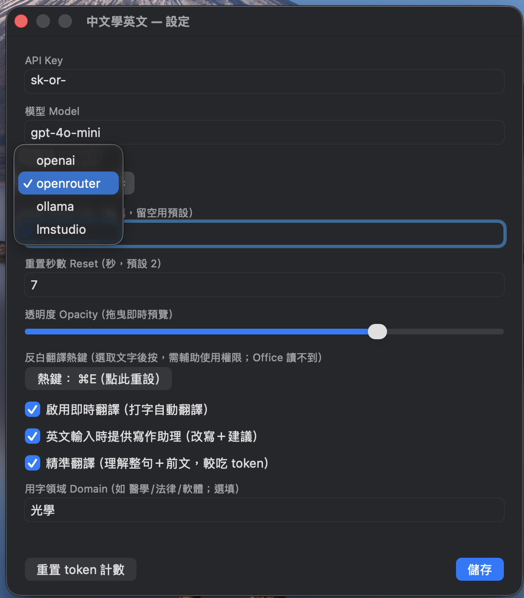
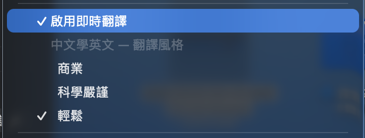

# TypeLingo · 打即通

**打中文，即時看到最好的英文 — 邊打邊學的 macOS 翻譯浮窗。**

> English: [README.md](README.md)

TypeLingo 掛進開源的中文輸入法，讓你每上屏一句中文，就在打字處的浮窗即時翻成自然英文 —— 在**任何 app（含 Microsoft Office）**都行。它同時是英文寫作助理，也是「反白任何文字就翻譯」的小工具。

> TypeLingo 是一個 Swift 檔 + 幾個掛接點，加進
> [vChewing](https://github.com/vChewing/vChewing-macOS) 的 fork。它與 vChewing
> **無隸屬關係、不使用其名稱/商標**。整合方式見 [INTEGRATION.md](INTEGRATION.md)。

---

## 截圖

| 即時翻譯 | 英文寫作助理 |
|---|---|
|  |  |
| **設定** | **選單列開關／風格** |
|  |  |

## ✨ 功能

- **即時打字翻譯** —— 上屏中文，英文**串流**逐字出現在打字處的原生浮窗（不受 webview 節流），任何 app（含 Office）皆可。
- **學習說明** —— 每句翻譯附一句繁中說明，點出關鍵用字／語氣／文法。
- **朗讀整句** —— 譯文結尾的 🔊 一鍵朗讀整句英文（再按一次停止）。預設系統語音（離線）；⚙ 可切 **高品質本機（Piper 神經語音，引擎內建、首次自動下載 ~64MB）** 或自訂 OpenAI 相容端點。
- **英文寫作助理** —— 打**英文**時自動改寫成道地英文、給中文意思、列出錯字／文法／用法建議。
- **反白翻譯** —— 在任何地方選取文字，按熱鍵（預設 ⌥⌘T）即翻譯／解析（走 Accessibility）。在浮窗上按 `⌘V` 可貼上剪貼簿內容分析。
- **精準模式** —— 理解整句、帶最近幾句當前文、套用用字領域，並修正注音口語／斷句造成的語意偏差。
- **風格切換** —— 商業／科學／輕鬆，浮窗或選單一鍵切。
- **地端與自架 LLM** —— OpenAI、OpenRouter、**Ollama**、**LM Studio**，或任何 OpenAI 相容端點（每個服務商各自設定；地端視為免費）。
- **Token／花費計量**，可重置。
- **質感浮窗** —— 半透明、可拖曳、可改大小、透明度滑桿、總開關。

## 🧠 運作原理

| 能力 | 機制 |
|---|---|
| 即時翻譯 | 輸入法 `commit` 掛接 → 累積整句 → 串流翻譯 |
| 英文擷取 | 側錄 ASCII 鍵（英文會被輸入法直接放行） |
| 反白／貼上翻譯 | macOS Accessibility（`AXSelectedText`）＋ Carbon 全域熱鍵 |
| 顯示 | 原生 `NSVisualEffectView` 浮窗（跨所有 Space、不被節流） |

## 📥 下載(免編譯)

到 [**Releases**](https://github.com/physictim/TypeLingo/releases) 抓已簽章+公證的 `TypeLingo.app`,免 build。

1. 解壓,移到輸入法資料夾:
   ```bash
   cp -R TypeLingo.app ~/Library/Input\ Methods/
   ```
2. **系統設定 → 鍵盤 → 輸入來源 → ＋ → 繁體中文 → TypeLingo → 加入**。
3. 切到 TypeLingo,打中文 → 英文串流進浮窗。
4. 浮窗 ⚙ 填 API Key(或 `~/.zhlearnime/config.json`)。
5. 反白翻譯(⌥⌘T)首次到 **系統設定 → 隱私權與安全性 → 輔助使用** 開啟 TypeLingo。

> 需 macOS 13+。Release 已去沙盒(讓反白翻譯能用)且經 Apple 公證。

## 🚀 自行編譯

需要一個 vChewing fork 來承載這個 hook。完整步驟見
**[INTEGRATION.md](INTEGRATION.md)**(改成你自己的牌見 [REBRAND.md](REBRAND.md)):

1. 把 `ZhLearnHook.swift` 複製進 vChewing 的 assembly package。
2. 加 4 個小掛接點（選單、activate、commit、英文擷取）+ `Info.plist` 的 ATS 鍵。
3. `bash scripts/build-sign-notarize.sh`（需 Apple Developer ID —— 現代 macOS 的輸入法必須公證；我們**去掉 App Sandbox** 重簽，讓 Accessibility 能用）。
4. 裝進 `~/Library/Input Methods/`，`pkill vChewing` 重載。

## ⚙️ 設定

設定放在 `~/.zhlearnime/config.json`（見 [`config.example.json`](config.example.json)）或浮窗的齒輪（⚙）。

**地端 LLM：** 服務商選 `ollama` / `lmstudio`（自動指向 `localhost`），或填 Base URL 給自架 server（如 `http://192.168.1.50:1234`）；路徑會自動補成 `/v1/chat/completions`。每個服務商各自保留 API Key／模型／Base URL。

> ⚠️ 別把沒驗證的地端 LLM 對公網裸開。建議用 Tailscale 這類 VPN，而非 port forwarding。

**高品質朗讀：** 🔊 預設用系統內建語音（離線、零設定）。想要更自然的神經語音，在 ⚙ 把「朗讀引擎」選 **高品質本機（Piper）** —— 神經語音引擎（[sherpa-onnx](https://github.com/k2-fsa/sherpa-onnx)，Apache-2.0）已**內建在 app 裡**，第一次按 🔊 會自動下載語音模型（[Piper](https://github.com/rhasspy/piper) 語音，~64MB，之後快取）。可在 ⚙ 換**語音（8 種美/英腔）**與調**語速（0.5–2×）**，**全離線、本機合成、不需自己架 server**。

> 進階：也可把引擎選「自訂 OpenAI 相容端點」接任何 TTS server（如本機 [Kokoro-FastAPI](https://github.com/remsky/Kokoro-FastAPI) `docker run -p 8880:8880 ghcr.io/remsky/kokoro-fastapi-cpu`、或雲端 `tts-1`）；端點預設 `http://localhost:8880`、語音 `af_heart`，連不上會自動退回系統語音。

## ⌨️ 用法

- 打中文 → 翻譯在浮窗串流出現。
- 切到英文輸入 → 進入寫作助理模式。
- 選取文字 + **⌥⌘T** → 翻譯選取內容（首次需授權 Accessibility）。
- 點浮窗 + **⌘V** → 翻譯剪貼簿內容。
- 拖曳移動、拖右下角握把改大小、⚙ 設定、✕ 關閉。
- 功能表列（輸入法圖示）→ 切換「啟用即時翻譯」／翻譯風格。

## 📄 授權與致謝

- TypeLingo 程式碼：**MIT** © 2026 Huang Yi-Hsiang。
- 設計用以整合 **vChewing**（MIT-NTL）。TypeLingo 為獨立專案，不使用 vChewing 名稱／商標；若你據此做出衍生輸入法，請遵守 vChewing 授權並改用你自己的名稱。

## ⚠️ 免責

建置可公證的輸入法需要 Apple Developer 帳號。去掉 App Sandbox 會讓輸入法擁有一般檔案／網路存取權 —— 請只建置與執行你信任原始碼的輸入法（本專案只有一個可讀的單檔）。你上屏的文字會被送到你設定的 LLM 端點。
